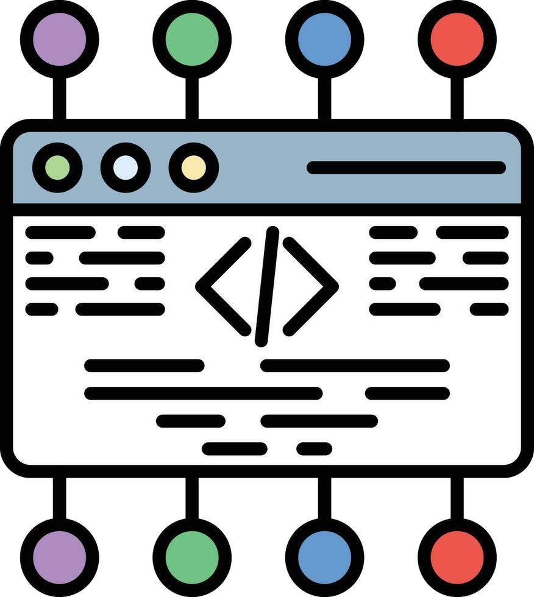
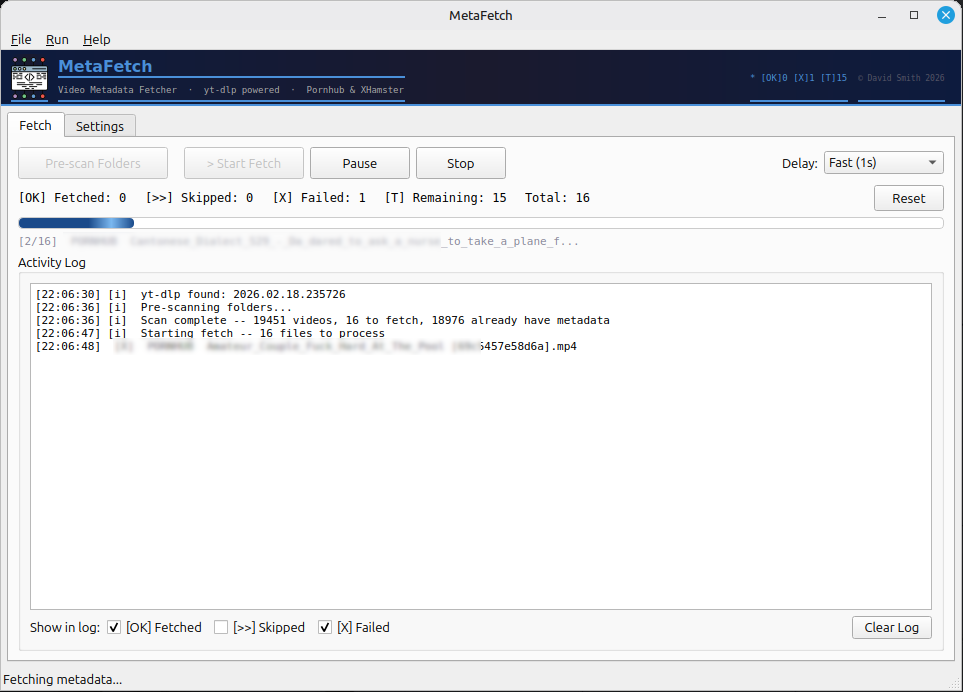
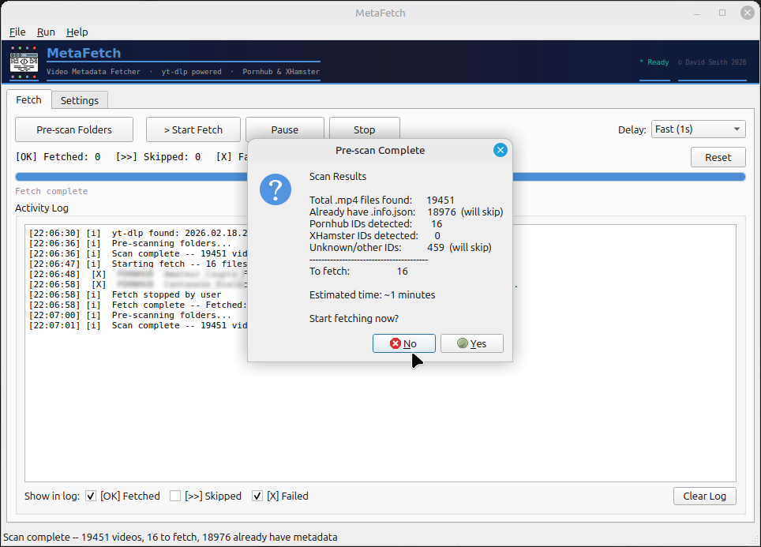
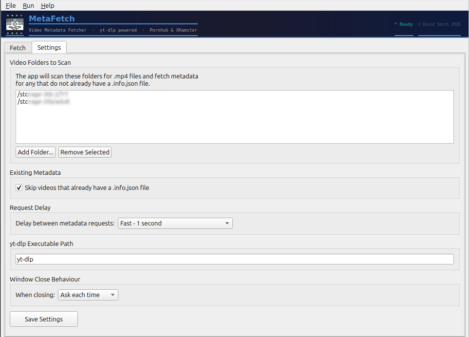

<p align="center">
  
</p>

<h1 align="center">MetaFetch</h1>

<p align="center">
  <strong>Desktop metadata fetcher for existing video libraries</strong><br>
  Powered by yt-dlp · Built with Python &amp; PyQt6
</p>

<p align="center">
  <a href="https://maxprovider.net/metafetch.html">⬇️ Download</a> ·
  <a href="https://maxprovider.net/plugins.html">🧩 Info JSON Importer Plugin</a> ·
  <a href="https://maxprovider.net">🌐 Website</a>
</p>

---

## What Is MetaFetch?

MetaFetch is a desktop GUI utility that scans your existing local video library and downloads missing `.info.json` metadata files using yt-dlp — **without re-downloading the videos themselves**.

It is designed for users who already have video collections but want to complement them with metadata for use in media management applications such as Stash and Jellyfin.

<p align="center">
  
</p>

---

## Why MetaFetch Exists

MetaFetch is ideal if:

* Your videos were downloaded without metadata enabled
* Metadata saving was not enabled in your downloader
* Your library was created using other tools
* You imported or inherited an existing collection
* You want richer metadata for indexing and organisation

MetaFetch fetches metadata later, on demand.

**No duplicate downloads. No video modification. No re-fetching video content.**

---

## Features

### Smart Library Scanning

* Scans configured folders for `.mp4` files
* Detects missing `.info.json` sidecar files
* Extracts embedded video IDs
* Automatically identifies supported source platforms

### Pre-scan Analysis

Before fetching, MetaFetch reports:

* Total videos detected
* Files already containing metadata
* Supported IDs found
* Unknown files skipped
* Estimated fetch workload

<p align="center">
  
</p>

### Metadata-Only Fetching

* Downloads `.info.json` only
* Never re-downloads videos
* Adjustable request delay (1s / 2s / 5s)
* Sequential rate-limited requests
* Live progress monitoring

### Intelligent Retry Protection

Failed or deleted video IDs are cached automatically to avoid repeated unnecessary retries.

### Desktop GUI Features

* Start / Pause / Resume / Stop
* Live activity log
* System tray support
* Persistent settings
* Built-in help system

<p align="center">
  
</p>

---

## How It Works

### 1. Add Video Folders

Choose folders containing your existing library.

### 2. Run Pre-scan

MetaFetch analyses the collection and shows what can be fetched.

### 3. Start Fetch

Metadata is downloaded sequentially.

### 4. Metadata Saved Beside Each File

Before:

```text
My Video [VIDEO_ID].mp4
```

After:

```text
My Video [VIDEO_ID].mp4
My Video [VIDEO_ID].info.json
```

---

## Perfect For Media Library Integration

Fetched metadata can be imported into media management applications.

### Companion Plugin: Info JSON Importer

The companion plugin imports `.info.json` metadata directly into Stash.

This can populate:

* Title
* Date
* Description
* Tags
* Studio
* Scene metadata

👉 https://maxprovider.net/plugins.html

---

## Companion Project

### Video Fetcher 2026

MetaFetch complements Video Fetcher 2026.

If metadata saving was not enabled when videos were originally downloaded, MetaFetch can fetch it later.

It is also useful for libraries created with completely different download workflows.

---

## Download

| Platform        | Download                                                |
| --------------- | ------------------------------------------------------- |
| 🐧 Linux x86_64 | [Download](https://maxprovider.net/files/MetaFetch)     |
| 🪟 Windows x64  | [Download](https://maxprovider.net/files/MetaFetch.exe) |

Standalone executable — no installation required.

---

## Installation

### Linux

```bash
wget https://maxprovider.net/files/MetaFetch
chmod +x MetaFetch
./MetaFetch
```

Install yt-dlp if needed:

```bash
sudo apt install yt-dlp
```

### Windows

Download:

```text
MetaFetch.exe
```

Double-click to run.

---

## Expected Filename Format

MetaFetch expects standard yt-dlp naming:

```text
Video Title [VIDEO_ID].mp4
```

The embedded ID is used to locate metadata.

If filenames have been renamed and the ID removed, metadata cannot be fetched.

---

## Tech Stack

* Python 3
* PyQt6
* yt-dlp
* Standalone native builds

---

## Changelog

### v1.0.0 — April 2026

* Initial release
* Cross-platform GUI
* Pre-scan engine
* Metadata-only fetching
* Failed-ID cache
* Pause / Resume / Stop
* System tray integration

---

## License

Free companion utility for Video Fetcher 2026.

---

<p align="center">
  <strong>MetaFetch</strong><br>
  © 2026 David Smith · <a href="https://maxprovider.net">maxprovider.net</a><br>
  david@maxprovider.net
</p>

